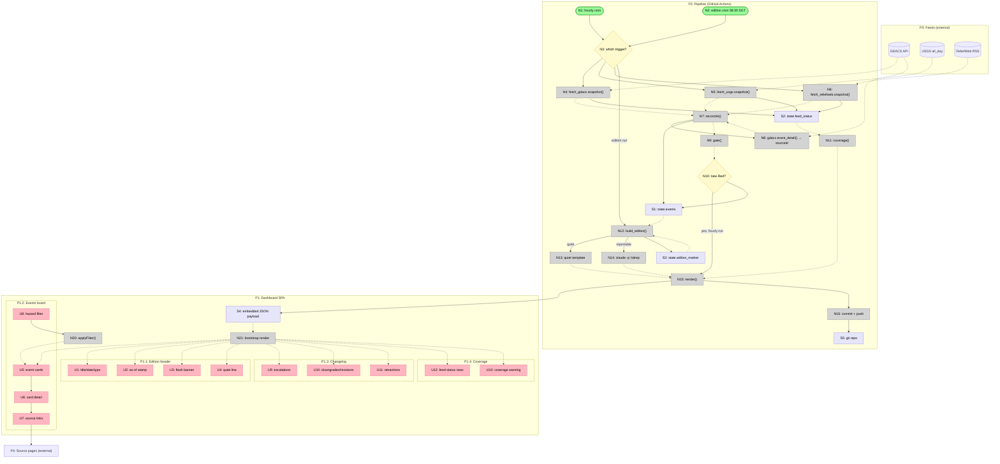

# HADR Monitor — Breadboard (Detail B)

Selected Shape B (`SHAPING.md`) translated into affordances and wiring.
Design-from-shaped-parts mode: parts B1–B7 become concrete U/N/S below.
Written piecemeal; sections are appended as they are completed.

## Places

| # | Place | Description |
|---|-------|-------------|
| P1 | Dashboard (`dashboard.html`) | The product surface: self-contained SPA opened in any browser |
| P1.1 | Edition header | Subplace: edition date/type, "as of" stamp |
| P1.2 | Events board | Subplace: current reportable events |
| P1.3 | Changelog | Subplace: changes since previous edition |
| P1.4 | Coverage | Subplace: per-feed status and warnings |
| P2 | Pipeline (GitHub Actions runner) | Backend place: scheduled jobs, scripts, model step |
| P3 | Feeds (external) | GDACS API, USGS summary feed, ReliefWeb RSS — systems we only read |
| P4 | Source pages (external) | GDACS report page, USGS event page, ReliefWeb disaster page — navigation targets |

## Data Stores

| # | Place | Store | Description |
|---|-------|-------|-------------|
| S1 | P2 | `data/state.json` › `events` | Canonical events: own ID, aliases[], hazard, gdacs_alert, pager_alert, magnitude, location, origin_time, reported, flash_published, last_changed, source_refs |
| S2 | P2 | `data/state.json` › `feed_status` | Per feed: last success, last feed_generated_at, consecutive failures |
| S3 | P2 | `data/state.json` › `edition_marker` | Watermark: which changes the last edition already told the reader about |
| S4 | P1 | Embedded payload in `dashboard.html` | JSON island: events + edition content + coverage, written at render, read by the SPA |
| S5 | P2 | Git repository | External store: committed state + dashboard; history is the audit log (ADR-0004) |

## UI Affordances (P1 — Dashboard SPA)

| # | Place | Component | Affordance | Control | Wires Out | Returns To |
|---|-------|-----------|------------|---------|-----------|------------|
| U1 | P1.1 | header | Edition title + date (SGT) + type badge (regular / quiet / flash) | render | — | — |
| U2 | P1.1 | header | "As of" timestamp (last successful pipeline run, SGT) | render | — | — |
| U3 | P1.1 | header | Flash alert banner (only when latest publish was a flash) | render | — | — |
| U4 | P1.1 | header | Quiet edition line ("No significant events — all feeds healthy") | render | — | — |
| U5 | P1.2 | events-board | Event cards list (current reportable events) | render | → U6 | — |
| U6 | P1.2 | event-card | Card: name, hazard icon, GDACS colour chip + PAGER chip (separate), magnitude/severity, place, origin time (SGT), affected-population line, assessment prose | render | → U7 | — |
| U7 | P1.2 | event-card | Source links (GDACS report / USGS event / ReliefWeb disaster) | click | → P4 | — |
| U8 | P1.2 | events-board | Hazard-type filter chips (EQ/TC/FL/VO/DR/WF) | click | → N20 | — |
| U9 | P1.3 | changelog | Escalation entries (prominent, top) | render | — | — |
| U10 | P1.3 | changelog | Downgrade / revision one-liners | render | — | — |
| U11 | P1.3 | changelog | Retraction notices ("USGS deleted event X — previously reported M5.2 was a false detection") | render | — | — |
| U12 | P1.4 | coverage | Per-feed status row (feed, last success, freshness) | render | — | — |
| U13 | P1.4 | coverage | Coverage warning banner ("GDACS unreachable since 03:10 SGT; EQ coverage via USGS only") | render | — | — |

Notes: every display U above is fed by the SPA bootstrap (N21) reading the
embedded payload S4 — wiring shown in the Code Affordances table and
diagram. U8→N20 is the only client-side interaction loop; everything else
is static render of S4 content.

## Code Affordances (P2 — Pipeline, and P1 client script)

| # | Place | Component | Affordance | Control | Wires Out | Returns To |
|---|-------|-----------|------------|---------|-----------|------------|
| N1 | P2 | sitrep.yml | Hourly cron trigger (`0 * * * *`) | trigger | → N3 | — |
| N2 | P2 | sitrep.yml | Edition cron trigger (`30 0 * * *` = 08:30 SGT) + `workflow_dispatch` | trigger | → N3 | — |
| N3 | P2 | sitrep.yml | Trigger branch: which cron fired? | conditional | → N4 (always), → N12 (edition only) | — |
| N4 | P2 | scripts/fetch_gdacs.py | `snapshot()` — GET `geteventlist/EVENTS4APP` | call | — | → N7, → S2 |
| N5 | P2 | scripts/fetch_usgs.py | `snapshot()` — GET `all_day.geojson`, filter `type=="earthquake"` | call | — | → N7, → S2 |
| N6 | P2 | scripts/fetch_reliefweb.py | `snapshot()` — GET disasters RSS, parse GLIDE from description | call | — | → N7, → S2 |
| N7 | P2 | scripts/reconcile.py | `reconcile(snapshots, state)` — alias join (GLIDE → sourceid → heuristic), episode folding, revision/retraction detection, aged-out guard | call | → N8 (per new/changed GDACS EQ), → S1, → S2 | → N9 |
| N8 | P2 | scripts/fetch_gdacs.py | `event_detail(eventid)` — GET `geteventdata`, extract `properties.sourceid` (SPIKE-1) | call | — | → N7 |
| N9 | P2 | scripts/gate.py | `gate(change_set, state)` — reportables + flash trigger per ADR-0002 | call | — | → N10, → N12 |
| N10 | P2 | sitrep.yml | Flash branch: `flash_trigger && hourly run`? | conditional | → N15 (with flash banner), → S1 (`flash_published`) | — |
| N11 | P2 | scripts/staleness.py | `coverage(feed_status)` — stale = no fresh success within 2× cadence | call | — | → N12, → N15 |
| N12 | P2 | scripts/edition.py | `build_edition(state, marker)` — changelog since S3, quiet/regular decision | call | → N13 (quiet) or → N14 (reportable), → S3 (advance marker) | — |
| N13 | P2 | scripts/edition.py | Quiet edition template (deterministic, no model) | call | — | → N15 |
| N14 | P2 | sitrep.yml | Guarded model step: `claude -p` runs `/sitrep` skill on reportables JSON → per-event assessment prose + edition summary | call | — | → N15 |
| N15 | P2 | scripts/render.py | `render(state, edition_content, coverage)` — writes the SPA with embedded JSON payload | call | → S4 | — |
| N16 | P2 | sitrep.yml | Commit step: `git add data/state.json dashboard.html && commit [skip ci] && push` | call | → S5 | — |
| N20 | P1 | inline `<script>` | `applyFilter(hazard)` — toggles card visibility | call | — | → U5 |
| N21 | P1 | inline `<script>` | Bootstrap: parse embedded JSON island, render all sections, convert times to SGT | call | — | → U1–U6, U9–U13 |

Concurrency note: all of N1/N2-triggered runs share one Actions
`concurrency` group (B7.2) so state commits serialise; not an affordance,
just the mechanism guaranteeing S1/S3 writes never race.

## Wiring

## Verification pass

- **Every display U has a source:** U1–U6, U9–U13 ← N21 ← S4 ← N15. ✅
- **Every N connects:** all Ns have Wires Out and/or Returns To; N13/N14
  both return edition content to N15 (mutually exclusive branches of N12). ✅
- **Every S is read:** S1←→N7/N12, S2→N11, S3→N12, S4→N21, S5 is the
  external audit store (read by humans/PRs). ✅
- **Navigation:** the only user navigation is U7 → P4 (external source
  pages); the dashboard is otherwise a single Place. ✅
- **Flash path traced:** N1→N3→fetch→N7→N9→N10(yes)→N15→N16 — flash
  publishes without touching N12/N14 (no model call unless the edition run
  needs one). Matches R5 + ADR-0003. ✅
- **Quiet morning traced:** N2→N3→fetch→N7→N9 (empty)→N12→N13→N15→N16 —
  no model call. Matches R4. ✅
- **Feed-down traced:** N4 fails → S2 records failure → N11 flags stale →
  N15 renders U13 in every subsequent publish. Matches R6. ✅
